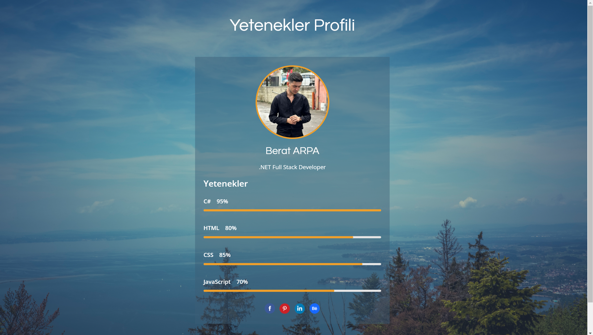

# Skills-Profile

## About

This is a web application themed around skill profiles, developed using the MVC (Model-View-Controller) architecture. The application allows users to showcase their skills and experiences in a structured and interactive way.

## Screenshot


## Features

- **Skill Management**: Add, update, and manage various skills and competencies.
- **Profile Display**: Display skill profiles in a user-friendly format.
- **Interactive UI**: Engaging user interface with dynamic content presentation.
- **Customizable Sections**: Customize and organize different sections of the skill profile.

## Technologies Used

- **ASP.NET MVC**: Framework for building the web application.
- **C#**: Programming language used for application logic.
- **Entity Framework**: ORM for database interactions.
- **SQL Server**: Database management system.
- **HTML/CSS/JavaScript**: For front-end development and styling.

## Installation

1. **Clone the Repository**:
    ```sh
    git clone https://github.com/BeratARPA/Skills-Profile.git
    ```
2. **Open with Visual Studio**: Open the project in Visual Studio.
3. **Install Dependencies**: Restore NuGet packages.
4. **Configure Database**: Set up the SQL Server database and connection strings in `appsettings.json`.
5. **Run the Project**: Press F5 or use the run command to start the application.

## Usage

1. **Access the Application**: Open the application from Visual Studio or the deployed URL.
2. **Manage Skills**: Use the application interface to add and manage skills.
3. **View Profiles**: Explore skill profiles in a structured format.

## Contributing

If you would like to contribute, please fork the repository, create a feature branch, and submit a pull request.

## License

This project is licensed under the MIT License. See the [LICENSE](LICENSE) file for more details.

## Contact

For questions or feedback, feel free to contact me:
- **Email**: [beratarpa@hotmail.com](mailto:beratarpa@hotmail.com)
- **GitHub**: [https://github.com/BeratARPA](https://github.com/BeratARPA)
